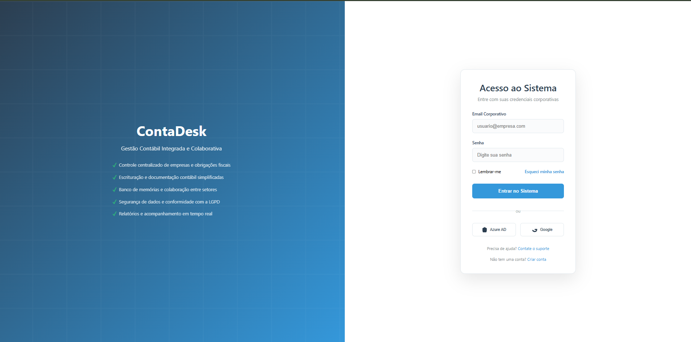
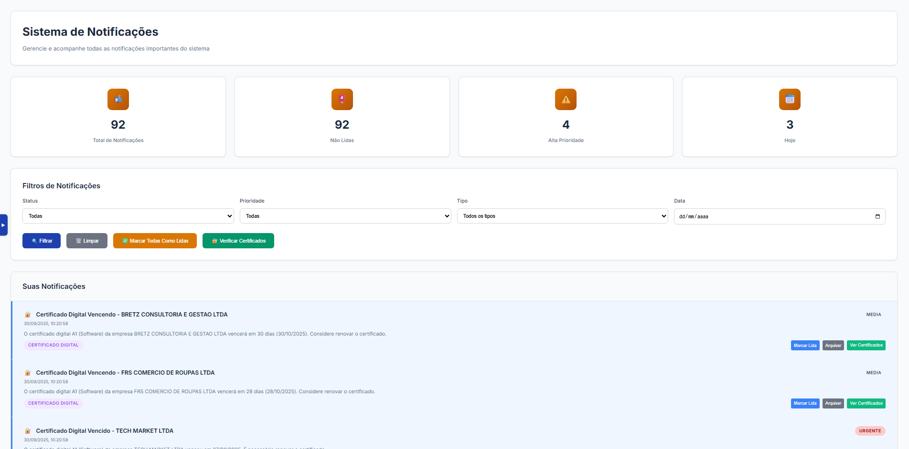
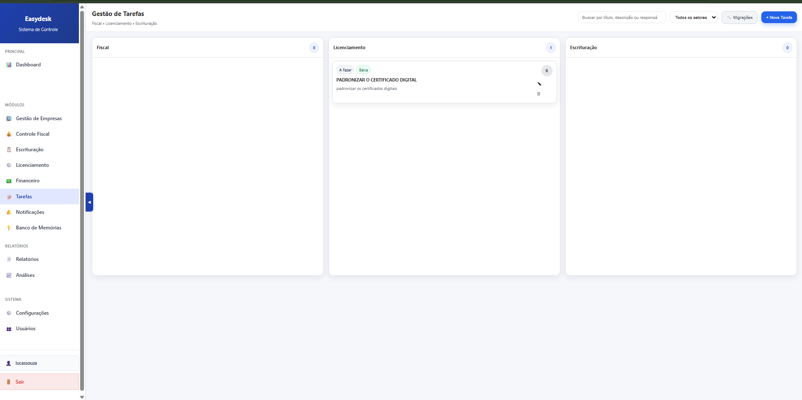

# 🏢 EasyDesk - Sistema de Gestão Contábil

Sistema completo de gestão contábil desenvolvido em Django para controle empresarial, fiscal e de licenciamento.

🔗 *Demo Online:* [https://web-production-52f4.up.railway.app](https://web-production-52f4.up.railway.app)

---

## 📌 Visão Geral

*EasyDesk* é uma plataforma web SaaS para gestão de tarefas contábeis, clientes, conformidade fiscal, licenciamento e auditorias.  
Desenvolvido para escritórios de contabilidade de pequeno a médio porte, centraliza processos operacionais em uma interface limpa e intuitiva.

Suporta múltiplos usuários com acesso baseado em funções, rastreamento de prazos, auditorias internas e integração de dados Excel.

---

## 🚀 Funcionalidades

### 📊 **Gestão de Empresas**
- Cadastro completo com validações de CNPJ e regime tributário
- Gestão de endereços e responsáveis
- Controle de empresas coligadas
- Histórico de alterações e auditoria

### 💼 **Módulo Fiscal**
- Controle de obrigações e integrações fiscais
- Importação/Exportação de dados fiscais
- Apuração por período
- Geração de DARF/GUIAS (quando suportado)
- Indicadores de obrigações em aberto e atrasos

### 📋 **Escrituração Contábil**
- Controle de escrituração por empresa
- Gestão de códigos de escrituração
- Controle de ECD (Escrituração Contábil Digital)
- Acompanhamento de status de escrituração
- Controle de confirmação por responsável
- Gestão de próximas escriturações

### 📚 **Banco de Memórias**
- Base legal contábil organizada por departamento
- Memórias por empresa e assunto
- Categorização por departamento (Comercial, Contábil, Fiscal, Trabalhista)
- Informações resumidas e base legal detalhada
- Controle de assuntos abordados

### 🔔 **Sistema de Notificações**
- Notificações personalizadas por tipo e categoria
- Controle de prioridades (Baixa, Média, Alta, Urgente)
- Agendamento de notificações
- Links de ação direta
- Controle de status (Pendente, Lida, Arquivada)
- Expiração automática de notificações
- Verificação automática de certificados vencidos
- Templates de notificação configuráveis

### 📋 **Licenciamento**
- Controle de licenças e vencimentos
- Gestão de certificados digitais
- Alertas de vencimento automáticos
- Controle de alvarás e licenças

### 👥 **Gestão de Usuários**
- Sistema de autenticação completo
- Controle de permissões por módulo
- Gestão de perfis de usuário
- Auditoria de acessos

### 🔍 **Auditoria**
- Rastreamento completo de alterações
- Log de ações por usuário
- Histórico de modificações
- Controle de integridade dos dados

### 💰 **Módulo Financeiro**
- Gestão financeira integrada
- Controle de receitas e despesas
- Análise de fluxo de caixa
- Relatórios financeiros
- Controle de fornecedores

### 📈 **Dashboard**
- Visão geral do sistema
- Indicadores executivos
- Estatísticas por módulo
- Gráficos e métricas em tempo real

### 📄 **Relatórios**
- Exportação em PDF, Excel e CSV
- Relatórios personalizáveis
- Agendamento de relatórios
- Compartilhamento de relatórios

## 🚀 **Funcionalidades Avançadas**

### 🔄 **Sistema de Notificações Inteligente**
- **Verificação Automática**: Monitora certificados digitais e vencimentos
- **Priorização Inteligente**: Classifica notificações por urgência
- **Agendamento**: Notificações programadas para momentos específicos
- **Templates Configuráveis**: Modelos personalizáveis para diferentes tipos
- **Fila de Processamento**: Sistema robusto para envio em massa
- **Configurações por Usuário**: Preferências individuais de notificação

### 🧠 **Banco de Memórias Contábil**
- **Base Legal Organizada**: Informações fiscais e contábeis por departamento
- **Categorização Inteligente**: Comercial, Contábil, Fiscal e Trabalhista
- **Busca Avançada**: Filtros por empresa, departamento e assunto
- **Histórico Completo**: Rastreamento de consultas e atualizações
- **Relacionamento de Dados**: Conexões entre memórias relacionadas

### 📊 **Dashboard Executivo**
- **Métricas em Tempo Real**: Indicadores atualizados automaticamente
- **Gráficos Interativos**: Visualizações dinâmicas dos dados
- **Filtros Personalizáveis**: Análises por período, empresa ou módulo
- **Exportação de Dados**: Relatórios em múltiplos formatos

### 🔐 **Segurança e Auditoria**
- **Log Completo**: Rastreamento de todas as ações do sistema
- **Controle de Acesso**: Permissões granulares por módulo
- **Integridade de Dados**: Validações e verificações automáticas
- **Backup Automático**: Proteção de dados críticos

---

## 🛠️ Tecnologias

- **Backend:** Django 5.2.4
- **Banco:** MySQL 9.3.0
- **Frontend:** HTML5, CSS3, JavaScript ES6+
- **Deploy:** Railway/Render (configurado)
- **Servidor:** Gunicorn + WhiteNoise

---

## 📁 Estrutura do Projeto

```
easydesk-contabilidade/
├── easydesk/           # Configurações Django
├── empresas/           # Módulo de empresas
├── fiscal/             # Módulo fiscal
├── escrituracao/       # Módulo de escrituração contábil
├── licenciamento/      # Módulo de licenças e certificados
├── dashboard/          # Dashboard e banco de memórias
├── notificacoes/       # Sistema de notificações
├── auditoria/          # Sistema de auditoria
├── financeiro/         # Módulo financeiro
├── usuarios/           # Gestão de usuários
├── accounts/           # Autenticação
├── configuracoes/      # Configurações do sistema
├── core/               # Utilitários centrais
├── utils/              # Funções auxiliares
├── templates/          # Templates HTML
├── static/             # Arquivos estáticos
├── media/              # Uploads e arquivos temporários
├── docs/               # Documentação
├── site/               # Documentação gerada
├── requirements.txt    # Dependências
├── Procfile           # Deploy
└── manage.py          # Django manager
```


---

## 🖼️ Screenshots da Plataforma

### 🔐 Tela de Login


### 📝 Tela de Registro


### 📊 Dashboard Principal


### 🧑‍💼 Gestão de Empresas


### 🧾 Controle Fiscal


### 🪪 Licenciamento


### 💰 Escrituração Contábil - Parte 1


### 💰 Escrituração Contábil - Parte 2


### 🗄️ Banco de Memórias


### 🔔 Sistema de Notificações


### 📋 Gestão de Tarefas


---

### 📊 **Sistema de Monitoramento**
- **Health Checks**: Verificação de status do sistema
- **Logs Detalhados**: Rastreamento de operações e erros
- **Métricas de Performance**: Monitoramento de recursos
- **Alertas Automáticos**: Notificações de problemas críticos

### 🛠️ **Ferramentas de Manutenção**
- **Migrações Automáticas**: Atualização do banco de dados
- **Backup Automático**: Proteção de dados
- **Limpeza de Cache**: Otimização de performance
- **Verificação de Integridade**: Validação de dados

### 🔄 **Processos Automatizados**
- **Verificação de Certificados**: Monitoramento de vencimentos
- **Geração de Relatórios**: Criação automática de documentos
- **Notificações Programadas**: Alertas em horários específicos
- **Sincronização de Dados**: Atualização entre módulos

---

---

## 📄 Licença

Este projeto é privado e proprietário.

## 👨‍💻 Autor
Lucas de Souza Antunes


Desenvolvido para gestão contábil empresarial.

---

**🚀 Sistema pronto para produção!** 
