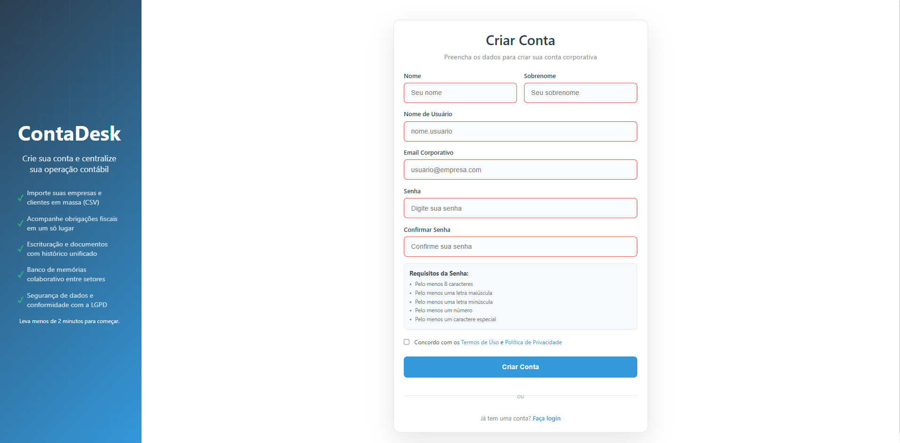
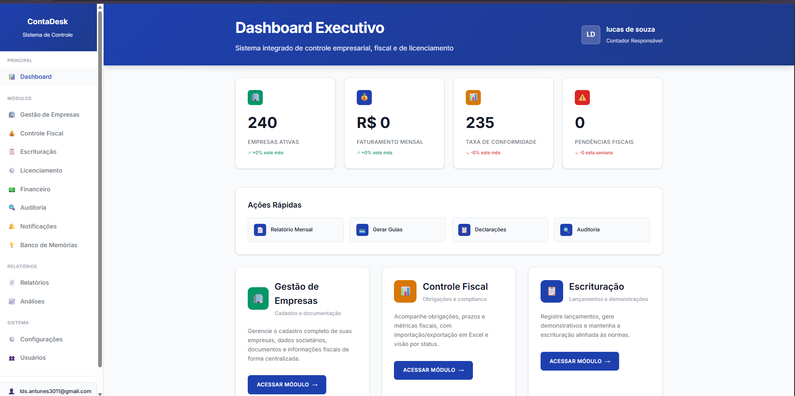
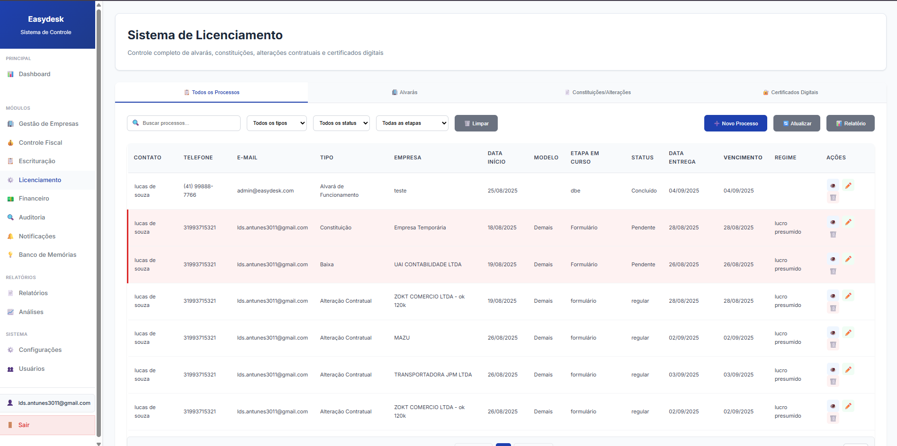

# 📊 EasyDesk – Enterprise Accounting Management System (DEMO)

This is a public demo of a real-world project developed for accounting firms.  
The complete system is online and deployed for demonstration purposes.  
The source code is not public due to contractual and data sensitivity reasons,  
but this repository describes the platform's features, structure, and architecture.

🔗 *Live Demo:* [https://web-production-52f4.up.railway.app](https://web-production-52f4.up.railway.app)

---

## 📌 Overview

*EasyDesk* is a SaaS-style web platform for managing accounting tasks, clients, tax compliance, licensing, and audits.  
Developed for small to mid-sized accounting firms, it centralizes operational processes in a clean and intuitive interface.

Supports multiple users with role-based access, deadline tracking, internal audits, and Excel data integration.

---

## ⚙️ Key Features

### 1. 🧑‍💼 Company & Client Management
- Complete registration with CNPJ validation
- Tax regime classification (MEI, Simples Nacional, Lucro Presumido, Lucro Real)
- Contact, address (CEP API), and document handling
- Status tracking and document organization

### 2. 🧾 Tax Compliance
- Fiscal obligation tracking with deadline alerts
- Excel import/export for obligations
- Compliance dashboard with real-time metrics

### 3. 🪪 Licensing Control
- Management of environmental, sanitary, and operational licenses
- Automatic expiration alerts and renewal workflows
- Multi-authority support

### 4. 💰 Financial Bookkeeping
- Bookkeeping entries and financial statements
- Regulatory tracking and audit-ready logs

### 5. 🔍 Internal Auditing
- Custom audit workflows and document review
- Risk flagging and compliance reports
- Internal status tracking

### 6. 👥 User & Permissions Management
- Role-based access for Admin, Auditor, Staff, and others
- Secure login and session handling
- Activity logs for internal monitoring

### 7. 🔔 Notification System
- Real-time and email alerts
- Alert rules based on deadlines and compliance flags
- User preference management

### 8. 📊 Dashboard & Reports
- Overview of tasks, alerts, compliance, and statuses
- Visual KPIs and metric cards
- Exportable reports for external review

### 9. 🗄️ Memory Bank
- System for storing and retrieving important information
- Document and reference organization
- Advanced search and filters

---

## 💻 Tech Stack

- *Backend:* Python · Django 5.2.4 · Django ORM  
- *Database:* MySQL 8.0+  
- *Frontend:* Django Templates · Custom CSS · Vanilla JavaScript  
- *Excel Handling:* pandas · openpyxl  
- *Authentication:* Django built-in + Custom RBAC  
- *Deployment:* Railway (CI/CD) · Gunicorn · WhiteNoise  
- *DevOps:* Git · python-decouple · Railway Env Vars

---

## 🗂️ Modules & Structure

easydesk/
├── accounts/          # User login and session
├── auditoria/         # Audit workflows
├── dashboard/         # Metrics and main views
├── empresas/          # Company/client data
├── escrituracao/      # Bookkeeping and statements
├── fiscal/           # Tax obligations
├── licenciamento/    # Business license control
├── notificacoes/     # Alerts and notifications
├── usuarios/         # Roles and access control
├── templates/        # Frontend templates
├── static/           # CSS/JS/Media assets
├── media/            # File uploads
└── easydesk/         # Settings and URLs

---

## 🖼️ Platform Screenshots

### 🔐 Login Screen

### 📝 Registration Screen

### 📊 Main Dashboard

### 🧑‍💼 Company Management

### 🧾 Tax Control

### 🪪 License Management

### 💰 Financial Bookkeeping - Part 1

### 💰 Financial Bookkeeping - Part 2

### 🗄️ Memory Bank

---

## 🔐 Security Highlights

- CSRF protection and template auto-escaping (XSS safe)
- SQL injection protection via Django ORM
- Role-based access with detailed user permissions
- Session-based authentication and secure password hashing

---

## 📊 Analytics & Performance

- Optimized database models with indexes and constraints
- Efficient pagination for large datasets
- Static asset caching and serving with WhiteNoise
- CI/CD with Railway and GitHub integration

---

## 🚀 Deployment & Infrastructure

The system is *fully deployed* on [Railway](https://railway.app), with:
- Production-ready PostgreSQL/MySQL database
- Static file serving via WhiteNoise
- Environment variables configured via python-decouple
- Auto-deploy from main branch using CI/CD

---

## 🎯 Project Objectives

### For Accounting Firms:
- *Automation* of manual and repetitive processes
- *Centralization* of client information and obligations
- *Compliance* with automatic fiscal alerts
- *Productivity* through intuitive dashboards

### Technical Benefits:
- *Scalability* for multiple users and clients
- *Security* with granular access control
- *Integration* with external systems via Excel
- *Complete audit* of all operations

---

## 🛠️ Technical Challenges Solved

1. *CNPJ Validation* - Implementation of Brazilian validation algorithm
2. *API Integration* - CEP, document validation
3. *Notification System* - Real-time and email alerts
4. *Access Control* - Custom RBAC for different profiles
5. *Excel Handling* - Import/export of fiscal data
6. *Production Deployment* - Complete Railway configuration

---

## 📈 Metrics & Results

- *Development Time:* 6 months
- *Lines of Code:* ~15,000 lines
- *Main Modules:* 9 Django modules
- *Templates:* 25+ responsive templates
- *Testing:* Coverage of critical functionalities

---

## 📬 Contact

*Developer:* Lucas Souza  
*Email:* lds.antunes3011@gmail.com  
*LinkedIn:* [linkedin.com/in/lucas-souza-a869882aa](https://www.linkedin.com/in/lucas-souza-a869882aa/)  
*GitHub:* [github.com/codewithsouza](https://github.com/codewithsouza)

---

## 📝 Disclaimer

This is a *demo-only repository*.  
The complete source code is *private* due to client confidentiality and data protection agreements.  
Feel free to reach out if you'd like to learn more about the architecture, security model, or deployment process.

---

## 🌟 Next Steps

- REST API implementation for external system integration
- Mobile app for push notifications
- Integration with government systems (eSocial, SPED)
- Advanced analytics and machine learning for risk prediction