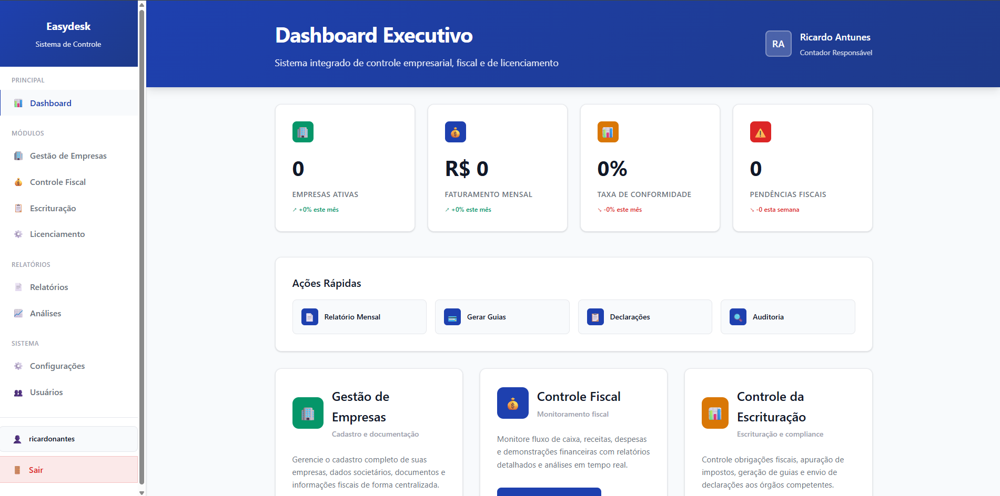
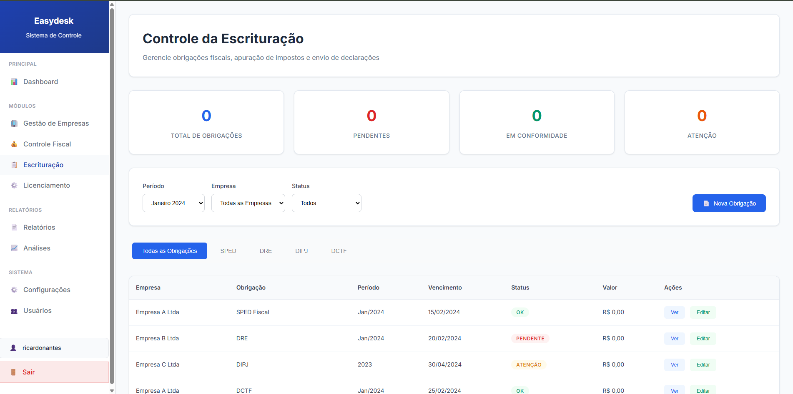

# 📊 EasyDesk – Accounting Management Platform (DEMO)

This is a public demo of a real-world project developed for accounting firms.  
The full system is online and deployed for demonstration purposes.  
Source code is not public due to contractual and data sensitivity reasons,  
but this repository outlines the platform's features, structure, and architecture.

🔗 **Live Demo:** [https://web-production-52f4.up.railway.app](https://web-production-52f4.up.railway.app)

---

## 📌 Overview

**EasyDesk** is a SaaS-style web platform for managing accounting tasks, clients, tax compliance, licenses, and audits.  
Designed for small to mid-sized accounting firms, it centralizes operational processes in a clean and intuitive interface.

Supports multiple users with role-based access, deadline tracking, internal audits, and Excel data integration.

---

## ⚙️ Key Features

### 1. 🧑‍💼 Company & Client Management
- Full registration with CNPJ validation
- Tax regime classification (MEI, Simples Nacional, Lucro Presumido, Lucro Real)
- Contact, address (CEP API), and document handling
- Status tracking and document organization

### 2. 🧾 Tax Compliance
- Fiscal obligation tracking with deadline alerts
- Excel import/export for obligations
- Compliance dashboard with real-time metrics

### 3. 🪪 Licensing Control
- Manage environmental, sanitary, and operational licenses
- Automatic expiration alerts and renewal workflows
- Multi-authority support

### 4. 💰 Financial Bookkeeping
- Bookkeeping entries and financial statements
- Regulatory tracking and audit-ready logs

### 5. 🔍 Internal Auditing
- Custom audit workflows and document review
- Risk flagging and compliance reports
- Internal status tracking

### 6. 👥 User & Permissions Management
- Role-based access for Admin, Auditor, Staff, and more
- Secure login and session handling
- Activity logs for internal monitoring

### 7. 🔔 Notifications
- Real-time and email alerts
- Alert rules based on deadlines and compliance flags
- User preference management

### 8. 📊 Dashboard & Reports
- Overview of tasks, alerts, compliance, and statuses
- Visual KPIs and metric cards
- Exportable reports for external review

---

## 💻 Tech Stack

- **Backend:** Python · Django 5.2.4 · Django ORM  
- **Database:** MySQL 8.0+  
- **Frontend:** Django Templates · Tailored CSS · Vanilla JavaScript  
- **Excel Handling:** `pandas` · `openpyxl`  
- **Authentication:** Django built-in + custom RBAC  
- **Deployment:** Railway (CI/CD) · Gunicorn · WhiteNoise  
- **DevOps:** Git · python-decouple · Railway Env Vars

---

## 🗂️ Modules & Structure
easydesk/
├── accounts/ # User login & session
├── auditoria/ # Audit workflows
├── dashboard/ # Metrics & home views
├── empresas/ # Company/client data
├── escrituracao/ # Bookkeeping and statements
├── fiscal/ # Tax obligations
├── licenciamento/ # Business license control
├── notificacoes/ # Alerts and notifications
├── usuarios/ # Roles and access control
├── templates/ # Frontend templates
├── static/ # CSS/JS/Media assets
├── media/ # File uploads
└── easydesk/ # Settings and URLs

### 🔐 Login  

### 📊 Dashboard  

### 🧾 Tax Compliance Module  

### 🪪 License Management  

### 🧑‍💼 Client Management  

### 🔍 Bookkeeping View  

---

## 🔐 Security Highlights

- CSRF protection and template auto-escaping (XSS safe)
- SQL injection protection via Django ORM
- Role-based access with detailed user permissions
- Session-based authentication and secure password hashing

---

## 📊 Analytics & Performance

- Optimized DB models with indexes and constraints
- Efficient pagination for large datasets
- Static asset caching and serving with WhiteNoise
- CI/CD with Railway and GitHub integration

---

## 📦 Deployment

The system is **fully deployed** on [Railway](https://railway.app), with:
- Production-ready PostgreSQL / MySQL database
- Static file serving via WhiteNoise
- Environment variables set via `python-decouple`
- Auto-deploy from `main` branch using CI/CD

---

## 📬 Contact

**Developer:** Lucas Souza 
**Email:** lds.antunes3011@gmail.com
**LinkedIn:** [linkedin.com/in/myprofile](https://www.linkedin.com/in/lucas-souza-a869882aa/)  
**Portfolio:** [myportfolio.com](https://github.com/codewithsouza)

---

## 📝 Disclaimer

This is a **demo-only repository**.  
The full source code is **private** due to client confidentiality and data protection agreements.  
Feel free to reach out if you'd like to learn more about the architecture, security model, or deployment process.

---
